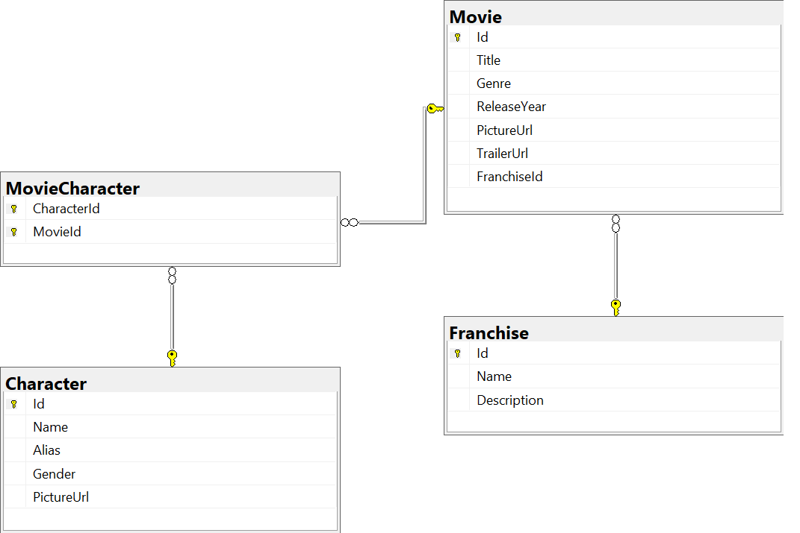

# DatabaseAndAccess

Assignment 3
Create a Web API and document it  

## Table of Contents
- [Features](#features)
- [Install](#install)
- [Usage](#usage)
- [Maintainers](#maintainers)

## Features

## Install
- Clone 
- Open in Visual Studio
- Go to appsettings.json -> Change DataSource in "DefaultConnection" to your own db connection.
- Build the application

## Usage
- Run the application from Visual Studio.
- Try out the different end points through Swagger in the browser.

## MovieCharacterDB Class Diagram

## Maintainers
- Mia Kristiansen
- Alexander Maaby
